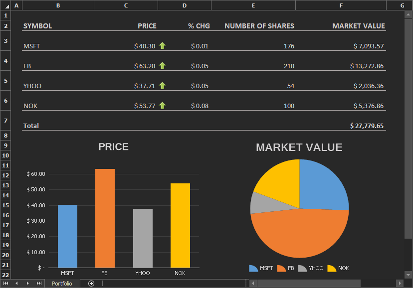

<!-- default badges list -->

<!-- default badges end -->

# WinForms Spreadsheet - Implement a Real-Time Data Server and Use the RTD Function

This example demonstrates how to use the RTD function to retrieve data in real time from a COM Automation server.

In this example, we use a custom server that implements the [IRtdServer](https://docs.microsoft.com/en-US/dotnet/api/microsoft.office.interop.excel.irtdserver) interface. Our server provides data for stock prices, number of shares, and price change. You can use the [SpreadsheetControl.Options.RealTimeData](https://docs.devexpress.com/OfficeFileAPI/DevExpress.Spreadsheet.DocumentOptions.RealTimeData) property to specify whether to update data manually or to use a timer for automatic updates.

To run the project, start Microsoft Visual Studio as an administrator. Elevated permissions are required to register the COM server after it is built.

## Files to Reivew

* [Form1.cs](./CS/TestRTDClient/Form1.cs) (VB: [Form1.vb](./VB/TestRTDClient/Form1.vb))
* [RtdServer.cs](./CS/TestRTDServer/RtdServer.cs) (VB: [RtdServer.vb](./VB/TestRTDServer/RtdServer.vb))

## Documentation

* [Real-Time Data (RTD) Function](https://docs.devexpress.com/WindowsForms/17023/controls-and-libraries/spreadsheet/formulas/functions/real-time-data-rtd-function)
<!-- feedback -->
## Does this example address your development requirements/objectives?

 

(you will be redirected to DevExpress.com to submit your response)
<!-- feedback end -->
